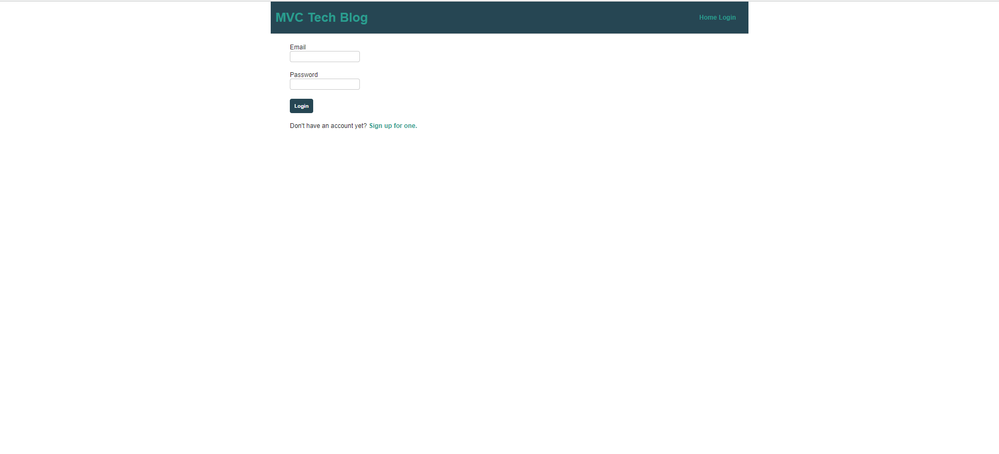
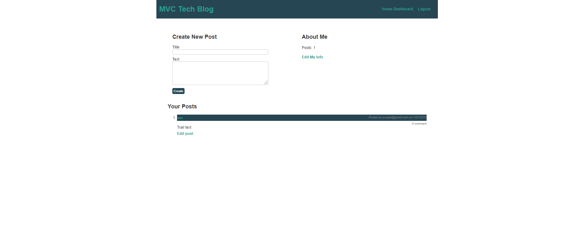

# Tech Blog

## Table of Contents
- [Description](#description)
- [Contributions](#contributions)
- [License](#license)

## Description
App will follow the MVC paradigm in its architectural structure, using Handlebars.js as the templating language, Sequelize as the ORM, and the express-session npm package for authentication.
   

[Heroku deployment](https://stark-earth-58391.herokuapp.com/).

## Screenshots

## License 
Licensed under the [MIT License](https://choosealicense.com/licenses/mit/).

## Questions
Any questions?
* [GitHub](https://github.com/daliyaebenny)

## Contributions
daliyaebenny
