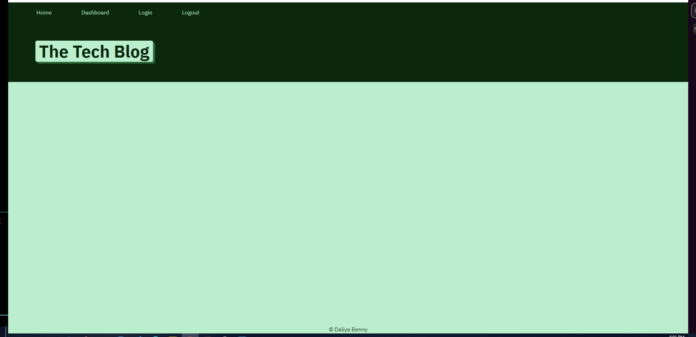
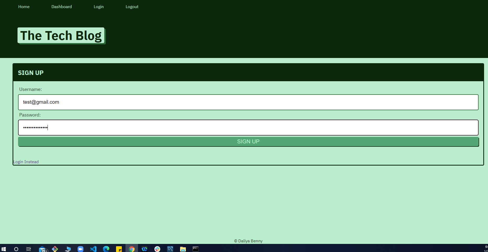
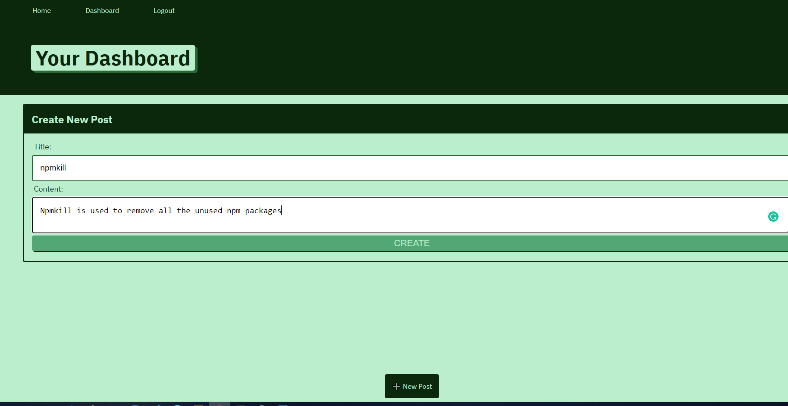
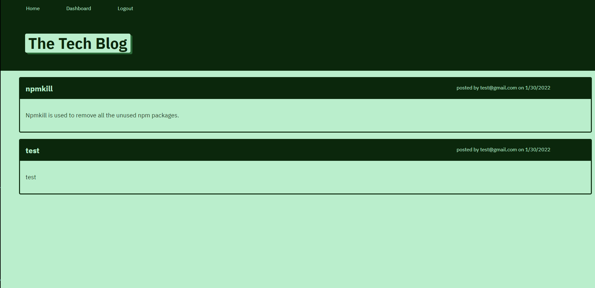

# Tech-Blog    

Writing about tech can be just as important as making it. Developers spend plenty of time creating new applications and debugging existing codebases, but most developers also spend at least some of their time reading and writing about technical concepts, recent advancements, and new technologies. A simple Google search for any concept covered in this course returns thousands of think pieces and tutorials from developers of all skill levels! 
This is a CMS-style blog site similar to a Wordpress site, where developers can publish their blog posts and comment on other developers’ posts as well. App is following the MVC paradigm in its architectural structure, and uses Handlebars.js as the templating language, Sequelize as the ORM, and the express-session npm package for authentication. It was developed over some starter code and deployed to Heroku.  
   

## Installation 
 - Clone the repository
 - npm i to install all the npm packages
 - Create database and update env file
 - npm start  

## Screenshots

 ## Contributor    
 Daliya Benny    

 ## Links
- [Github](https://github.com/daliyaebenny/Tech-Blog.git)    
- [Live](https://techblog-dal.herokuapp.com/)